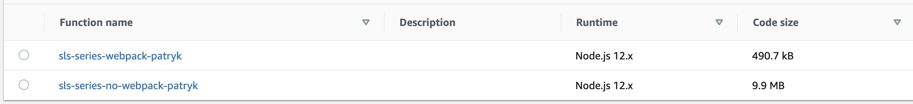

# when serverless-webpack is missing :(

Shows potential problems when not using Webpack with Node.js Lambdas.

Reader function which uses the same dependencies as reader function from `../stacks/webpack` 
and does the same stuff, has different package size:

- Webpack: 490.7 kB
- No Webpack: 9.9 MB

And because of the linear cold start time relation to package size, smaller package size = 
smaller cold start time.

