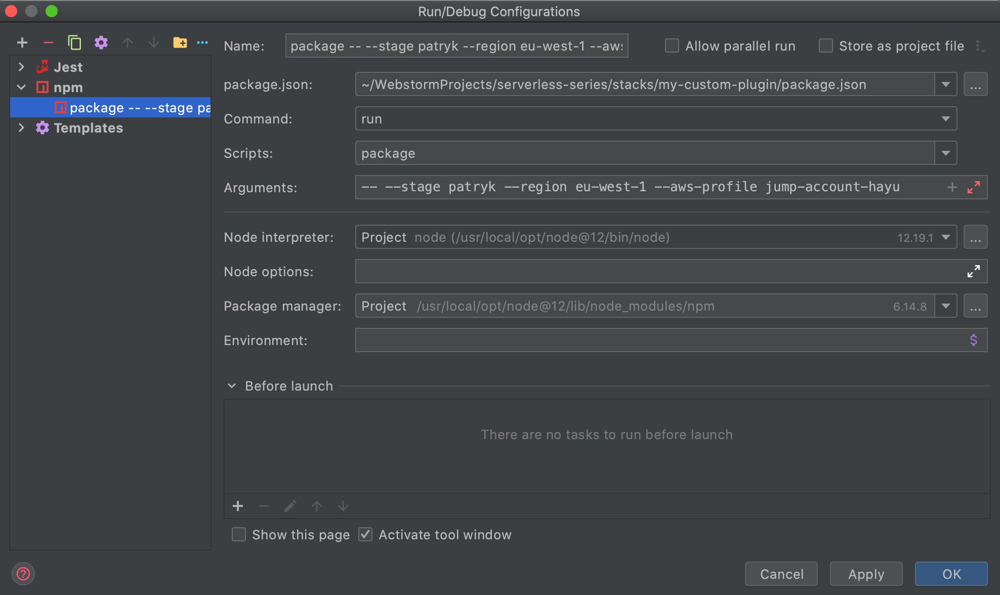

# my-custom-plugin

An example of a stack, that uses custom Serverless Plugin.

1. Firstly add dev-dependency to plugin in package.json:
```json
{
  "devDependencies": {
    "@serverless-series/serverless-dynamodb-throttling-alarms": "1.0.0"
  }
}
```
2. Now use plugin in `serverless.yml`:
```yaml
plugins:
  - '@serverless-series/serverless-dynamodb-throttling-alarms'
```
3. Plugin should be started after package phase. To test it, invoke package phase and then check out
output in `./serverless/cloudformation-template-update-stack.json` if it includes generated Alarms.
```bash
yarn run package --stage patryk --aws-profile jump-account-hayu --region eu-west-1
```

Last step can be replaced with deployment and then in stack resources, you can find your alarms.


### Debugging

If you wish to debug your plugin, then simply use following WebStorm run configuration. It will start
npm package phase with attached debugger. Due to this, if you have any breakpoints in
`../../plugins/serverless-dynamodb-throttling-alarms/index.js` debugger should stop on them.




### Warning!

Remember, that plugins code should be plain JavaScript, without any transpilers like Babel.
Due to this, some modern JS constructs are not available.