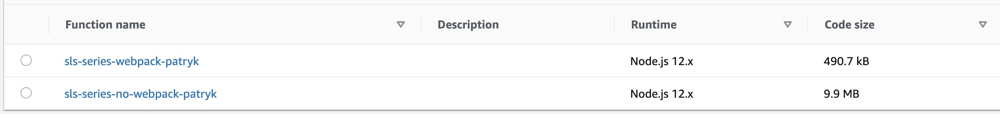

# serverless-webpack example

Very simple Node.js Lambda, that uses serverless-webpack plugin.

Reader function which uses the same dependencies as reader function from `../../no-webpack` 
and does the same stuff, has different package size:

- Webpack: 490.7 kB
- No Webpack: 9.9 MB

And because of the linear cold start time relation to package size, smaller package size = 
smaller cold start time.

### Babel support

Also thanks to serverless-webpack, Babel integration is a lot easier.

(Babel is used for having latest JavaScirpt features in old runtimes)